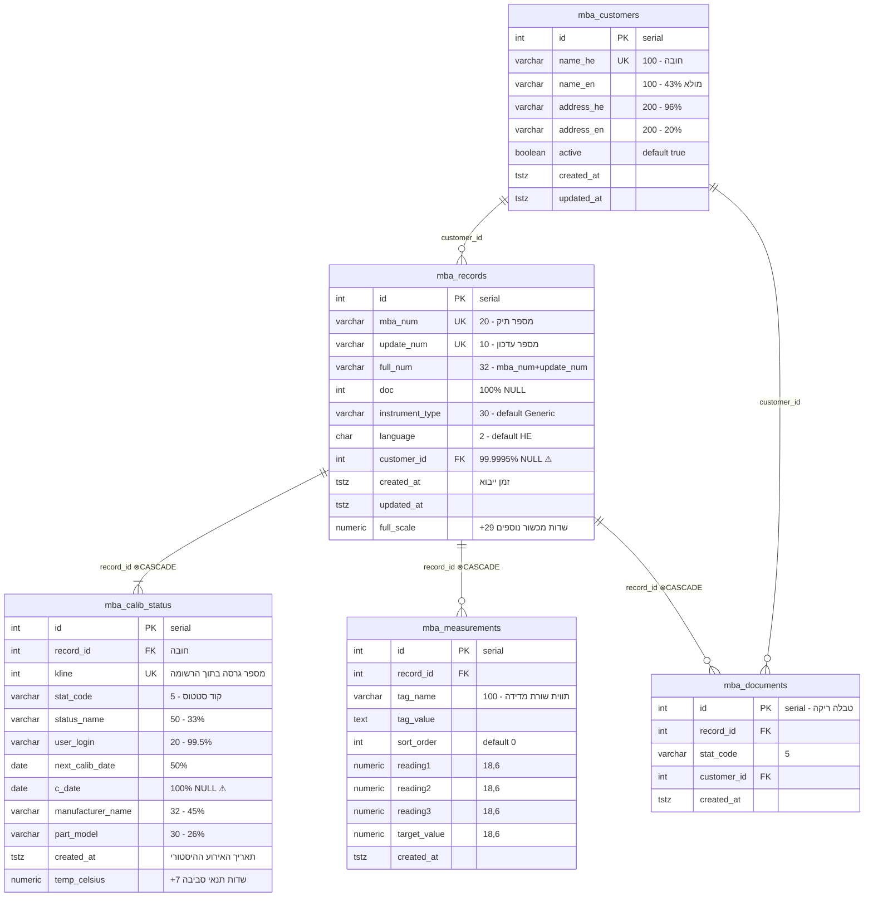
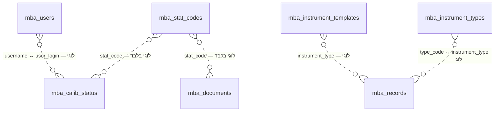

# MABA 2000 — תיעוד סכימה מלא + תרשים ישויות

> **מסד:** PostgreSQL **16.12** · container `maba2000-db` · DB `maba2000` · schema `public`
> **תאריך הפקה:** 2026-07-29 · **מקור:** `pg_catalog` / `information_schema` חיים + ספירות `COUNT(*)` בפועל
> **היקף:** 15 טבלאות בסיס · 150 עמודות · 7,051,231 שורות · 1,244 MB
> **ללא:** views (0) · טריגרים (0) · CHECK constraints (0) · טבלאות מחולקות · אינדקסים שאינם btree
> מסמך משלים ל-[DB-MAPPING-AND-USAGE.md](DB-MAPPING-AND-USAGE.md) (ניתוח שימוש ואינדקסים).

**הערה על שיעורי מילוי:** העמודה "מילוי" בכל טבלה מציגה כמה שורות מכילות ערך שאינו NULL, מתוך ספירה מלאה
(`COUNT(col)` מול `COUNT(*)`) — לא הערכה. זהו האות החזק ביותר לאילו שדות באמת בשימוש.

---

## 1. תרשים ישויות (ERD)

### 1.1 הליבה התפעולית



### 1.2 תבניות מכשור ונתוני ייחוס

```mermaid
erDiagram
    mba_instrument_templates ||--|{ mba_template_rows : "template_id ⊗CASCADE"

    mba_instrument_templates {
        int      id PK "identity"
        varchar  instrument_type UK "50 - 43 סוגים"
        varchar  meas_unit "20 - יחידת מידה"
        numeric  tolerance "10,4 - סבילות %"
        varchar  dev_type "5 - FS או PT"
        numeric  full_scale "18,6"
        varchar  source_file "200 - קובץ xls מקור"
        tstz     created_at
        tstz     updated_at
    }

    mba_template_rows {
        int      id PK "identity"
        int      template_id FK
        int      sort_order "סדר תצוגה"
        varchar  label "100 - תווית עברית"
        boolean  is_separator "שורת מפריד ---"
        text     detail "תווית אנגלית"
        numeric  target_value
    }

    mba_stat_codes {
        varchar  code PK "5 - 15 קודים"
        varchar  name_he "60"
        varchar  name_en "60"
        varchar  category "20 - OPEN/CLOSE/DELAY/HISTORY/DATE/OTHER"
    }

    mba_instrument_types {
        int      id PK "serial - 9 שורות"
        varchar  type_code UK "30"
        varchar  name_he "100"
        varchar  name_en "100"
        jsonb    template_fields "ריק בכל השורות"
    }

    mba_users {
        int      id PK "serial - 260 שורות"
        varchar  username UK "50"
        varchar  username_en "50"
        varchar  password_hash "255"
        text     role "Admin או ריק"
        boolean  active
        tstz     created_at
        tstz     updated_at
    }

    mba_app_config {
        int      id PK "identity"
        varchar  category UK "50"
        varchar  key UK "100"
        varchar  value "2000"
        varchar  description "500"
        tstz     updated_at
        varchar  updated_by "50"
    }

    mba_sync_log {
        int      id PK "identity"
        varchar  sync_type "30"
        varchar  status "20"
        tstz     started_at
        tstz     completed_at
        int      items_synced
        varchar  error_message "2000"
        varchar  initiated_by "50"
    }

    mba_audit_log {
        bigint   id PK "serial - טבלה ריקה"
        varchar  table_name "50"
        int      record_id
        varchar  action "10"
        varchar  user_login "50"
        tstz     changed_at
        jsonb    payload
    }

    mba_report_templates {
        int      id PK "serial - טבלה ריקה"
        varchar  name "100"
        char     language "2"
        varchar  instrument_type "30"
        text     content
        tstz     created_at
    }
```



### 1.3 קשרים לוגיים שאינם אכופים ב-DB ⚠

הקשרים הבאים קיימים בקוד ובנתונים אך **אין עליהם FOREIGN KEY** — המסד לא ימנע ערך יתום:



בבדיקה בפועל: כל 15 ערכי `stat_code` בשימוש קיימים ב-`mba_stat_codes` — **אין כרגע יתומים**.
לעומת זאת `mba_records.instrument_type` מכיל 4 ערכים בלבד (`Generic`, `Pressure`, `Vernier`, `Temperature`)
שכולם קיימים ב-`mba_instrument_templates` (43 שורות) אך רק 3 מהם ב-`mba_instrument_types` (9 שורות) —
שתי טבלאות הייחוס אינן מסונכרנות זו עם זו.

### 1.4 תרשים טקסטואלי (fallback)

```
                       ┌─────────────────┐
                       │  mba_customers  │  6,824
                       └────────┬────────┘
                     customer_id│         │customer_id
                (99.9995% NULL) │         │
                       ┌────────▼────────┐│
                       │   mba_records   ││  1,106,156
                       └────┬───┬───┬────┘│
              record_id ⊗   │   │   │ ⊗   │
        ┌───────────────────┘   │   └─────┼──────────┐
        │                       │ ⊗       │          │
┌───────▼──────────┐  ┌─────────▼──────┐  │  ┌───────▼────────┐
│ mba_calib_status │  │mba_measurements│  └──│ mba_documents  │
│    5,937,545     │  │       54       │     │       0        │
└──────────────────┘  └────────────────┘     └────────────────┘

┌──────────────────────────┐     ┌───────────────────┐
│ mba_instrument_templates │ 43  │ mba_template_rows │ 310
└────────────┬─────────────┘  ⊗  └───────────────────┘
             └────────template_id──────────┘

עצמאיות (ללא FK):  mba_stat_codes 15 · mba_instrument_types 9 · mba_users 260
                   mba_app_config 12 · mba_sync_log 8 · mba_audit_log 0
                   mba_report_templates 0 · __EFMigrationsHistory 19

⊗ = ON DELETE CASCADE
```

---

## 2. סקירת טבלאות

| # | טבלה | שורות | גודל | אינדקסים | מקור יצירה | תפקיד |
|---|------|---:|---:|---:|---|---|
| 1 | `mba_calib_status` | 5,937,545 | 1054 MB | 498 MB | schema.sql | היסטוריית סטטוס append-only |
| 2 | `mba_records` | 1,106,156 | 174 MB | 75 MB | schema.sql | רשומות כיול — השדרה המרכזית |
| 3 | `mba_customers` | 6,824 | 7480 kB | 2.7 MB | schema.sql | לקוחות |
| 4 | `mba_users` | 260 | 128 kB | 48 kB | schema.sql | משתמשים |
| 5 | `mba_template_rows` | 310 | 88 kB | 32 kB | EF migration | שורות תבנית מדידה |
| 6 | `mba_measurements` | 54 | 88 kB | 32 kB | schema.sql | מדידות מובנות (מערכת חדשה) |
| 7 | `mba_app_config` | 12 | 48 kB | 32 kB | EF migration | קונפיגורציה |
| 8 | `mba_instrument_types` | 9 | 48 kB | 32 kB | schema.sql | סוגי מכשור (ייחוס ישן) |
| 9 | `mba_instrument_templates` | 43 | 40 kB | 32 kB | EF migration | תבניות מכשור (ייחוס פעיל) |
| 10 | `mba_sync_log` | 8 | 32 kB | 16 kB | EF migration | לוג סנכרון Priority |
| 11 | `mba_stat_codes` | 15 | 24 kB | 16 kB | schema.sql | קודי סטטוס |
| 12 | `__EFMigrationsHistory` | 19 | 24 kB | 16 kB | EF | היסטוריית מיגרציות |
| 13 | `mba_audit_log` | **0** | 16 kB | 8 kB | schema.sql | לוג ביקורת — לא פעיל |
| 14 | `mba_report_templates` | **0** | 16 kB | 8 kB | schema.sql | תבניות דוח legacy |
| 15 | `mba_documents` | **0** | 8 kB | 8 kB | schema.sql | מסמכים — לא בשימוש |

**"מקור יצירה"** נגזר מסוג עמודת ה-`id`: טבלאות עם `nextval(...)` (SERIAL) נוצרו ב-`database/schema.sql`;
טבלאות עם `GENERATED BY DEFAULT AS IDENTITY` נוצרו ע"י מיגרציות EF Core. שני דורות סכימה חיים זה לצד זה.

שתי הטבלאות הראשונות = **99.2% מנפח המסד**.

---

## 3. פירוט טבלאות

### 3.1 `mba_records` — רשומות כיול · 1,106,156 שורות · 174 MB

השדרה המרכזית. כל שורה = **גרסה אחת של תיק כיול**: `mba_num` הוא מספר התיק, `update_num` הוא מספר
העדכון בתוכו. 141,845 תיקים ייחודיים × ממוצע **7.80 גרסאות** לתיק (מקסימום 200).

| # | עמודה | טיפוס | NULL | ברירת מחדל | מילוי | הערה |
|---|------|------|---|---|---:|---|
| 1 | `id` | integer | NO | serial | 100% | PK |
| 2 | `mba_num` | varchar(20) | NO | | 100% | מספר תיק — 141,845 ערכים ייחודיים |
| 3 | `update_num` | varchar(10) | NO | `'001'` | 100% | מספר גרסה — 222 ערכים ייחודיים |
| 4 | `full_num` | varchar(32) | YES | | 100% | שרשור `mba_num`+`update_num` |
| 5 | `doc` | integer | YES | | **0%** | מספר מסמך Priority — לא יובא |
| 6 | `instrument_type` | varchar(30) | NO | `'Generic'` | 100% | 4 ערכים בלבד בפועל |
| 7 | `language` | char(2) | NO | `'HE'` | 100% | `HE` בכל השורות |
| 8 | `customer_id` | integer | YES | | **0.0005%** | FK ללקוח — **5 שורות בלבד** ⚠ |
| 9 | `created_at` | timestamptz | NO | `now()` | 100% | זמן ה**ייבוא** (23.2.26–11.3.26), לא זמן האירוע |
| 10 | `updated_at` | timestamptz | NO | `now()` | 100% | |
| 11 | `dev_type` | varchar(5) | YES | | 7 שורות | סוג סטייה: `FS` (מלוא הסקאלה) / `PT` (מנקודה) |
| 12 | `full_scale` | numeric(18,6) | YES | | 1 שורה | טווח מלא |
| 13 | `meas_unit` | varchar(20) | YES | | 4 שורות | יחידת מידה |
| 14 | `tolerance` | numeric(10,4) | YES | | 7 שורות | סבילות באחוזים |
| 15 | `calib_description` | varchar(2000) | YES | | 1 שורה | |
| 16 | `calib_location` | varchar(200) | YES | | 1 שורה | מקום הכיול |
| 17 | `cert_notes` | varchar(1000) | YES | | **0%** | הערות לתעודה |
| 18 | `item_condition` | varchar(100) | YES | | 1 שורה | מצב הפריט בקבלה |
| 19 | `item_description` | varchar(300) | YES | | 1 שורה | תיאור הפריט |
| 20 | `item_model` | varchar(80) | YES | | 1 שורה | דגם |
| 21 | `manufacturer` | varchar(80) | YES | | 1 שורה | יצרן |
| 22 | `serial_number` | varchar(50) | YES | | 1 שורה | מספר סידורי |
| 23 | `standards_used` | varchar(500) | YES | | 1 שורה | תקנים ששימשו |
| 24 | `internal_notes` | text | YES | | **0%** | |
| 25 | `quick_notes` | text | YES | | **0%** | |
| 26 | `calib_standard` | text | YES | | **0%** | |
| 27 | `resolution` | text | YES | | 1 שורה | רזולוציית המכשיר |
| 28 | `sensor_type` | text | YES | | **0%** | |
| 31 | `ref_std_serial_number` | text | YES | | 1 שורה | מס' סידורי של תקן הייחוס |
| 32 | `tolerance_offset` | numeric | YES | | **0%** | |
| 33 | `calib_spec_num` | text | YES | | 1 שורה | מספר מפרט כיול |
| 34 | `calib_device` | varchar(100) | YES | | 1 שורה | |
| 35 | `calib_direction` | varchar(10) | YES | | 1 שורה | כיוון הכיול |
| 36 | `exam_type` | varchar(20) | YES | | 1 שורה | |
| 37 | `fluid_column_height` | numeric(10,2) | YES | | 1 שורה | גובה עמוד נוזל (לחץ) |
| 38 | `master_unit` | varchar(20) | YES | | 1 שורה | |
| 39 | `precision_class` | varchar(30) | YES | | 1 שורה | מחלקת דיוק |
| 40 | `test_medium` | varchar(100) | YES | | 1 שורה | מדיום הבדיקה |
| 41 | `test_position` | varchar(20) | YES | | 1 שורה | |

> **מיקומים 29–30 חסרים** — עמודות שהוסרו במיגרציה. אין השפעה תפקודית.
>
> **תובנה מרכזית:** עמודות 11–41 (31 שדות מכשור ותעודה) מלאות ב-**1–7 שורות בלבד** מתוך 1.1M.
> כל הפירוט התפעולי של הנתונים ההיסטוריים יושב ב-`mba_calib_status`, לא כאן. ה-`mba_records`
> המיובאת היא מפתח-בלבד: `mba_num`/`update_num`/`full_num`/`instrument_type`/`language`.

**התפלגות `instrument_type`:**

| ערך | שורות |
|---|---:|
| `Generic` | 1,106,151 |
| `Pressure` | 2 |
| `Vernier` | 2 |
| `Temperature` | 1 |

**מפתחות:**
- `mba_records_pkey` — PRIMARY KEY (`id`)
- `mba_records_mba_num_update_num_key` — UNIQUE (`mba_num`, `update_num`)
- `mba_records_customer_id_fkey` — FOREIGN KEY (`customer_id`) → `mba_customers(id)` · **ללא CASCADE**

**אינדקסים:** `mba_records_mba_num_update_num_key` 33 MB · `mba_records_pkey` 24 MB ·
`idx_records_mba_num` (`mba_num`) 11 MB · `idx_records_customer` (`customer_id`) 7032 kB

---

### 3.2 `mba_calib_status` — היסטוריית סטטוס · 5,937,545 שורות · 1054 MB ⭐

הטבלה הגדולה במסד (85% מהנפח). **Append-only**: כל שינוי במחזור החיים של רשומה = שורה חדשה.
הסטטוס הנוכחי = השורה עם ה-`kline` הגבוה ביותר עבור `record_id`.

**כל 1,106,156 הרשומות מכוסות** — אין רשומה ללא סטטוס. ממוצע 5.37 שורות לרשומה.

| # | עמודה | טיפוס | NULL | ברירת מחדל | מילוי | הערה |
|---|------|------|---|---|---:|---|
| 1 | `id` | integer | NO | serial | 100% | PK |
| 2 | `record_id` | integer | NO | | 100% | FK → `mba_records` |
| 3 | `kline` | integer | NO | | 100% | מספר שורה בתוך הרשומה (1…2207) |
| 4 | `stat_code` | varchar(5) | NO | | 100% | קוד סטטוס — ראו 3.9 |
| 5 | `status_name` | varchar(50) | YES | | 33.2% | שם הסטטוס כטקסט חופשי |
| 6 | `user_login` | varchar(20) | YES | | **99.5%** | מי ביצע — השדה השימושי ביותר לביקורת |
| 7 | `auth_name` | varchar(100) | YES | | **0%** | מאשר |
| 8 | `reject_notes` | varchar(5) | YES | | **0%** | |
| 9 | `union_report` | varchar(50) | YES | | **0%** | |
| 10 | `next_calib_date` | date | YES | | 49.8% | תאריך הכיול הבא |
| 11 | `part_model` | varchar(30) | YES | | 25.7% | דגם הפריט |
| 12 | `manufacturer_name` | varchar(32) | YES | | 45.3% | שם יצרן |
| 13 | `manufacturer_code` | varchar(17) | YES | | 21.9% | קוד יצרן |
| 14 | `memo` | varchar(10) | YES | | **0%** | |
| 15 | `c_date` | date | YES | | **0%** | תאריך כיול — **ריק לחלוטין** ⚠ |
| 16 | `created_at` | timestamptz | NO | `now()` | 100% | **תאריך האירוע ההיסטורי האמיתי** (2000–2027) |
| 17 | `humidity_pct` | numeric(6,2) | YES | | 1 שורה | לחות יחסית |
| 18 | `mifrat_code` | varchar(5) | YES | | **0%** | קוד מפרט |
| 19 | `result` | varchar(20) | YES | | **0%** | תוצאת הכיול |
| 20 | `temp_celsius` | numeric(6,2) | YES | | 1 שורה | טמפרטורה |
| 21 | `barometric_pressure` | numeric | YES | | 1 שורה | לחץ ברומטרי |
| 22 | `calibrator_id` | text | YES | | **0%** | מזהה המכייל |
| 23 | `barometric_uncertainty` | numeric | YES | | **0%** | אי-ודאות |
| 24 | `humidity_uncertainty` | numeric | YES | | **0%** | אי-ודאות |
| 25 | `temp_uncertainty` | numeric | YES | | **0%** | אי-ודאות |

> ⚠ **`c_date` ריק ב-100% מהשורות** — למרות שהוא שדה "תאריך הכיול". התאריך ההיסטורי האמיתי
> שרד רק ב-`created_at`. כל שאילתת "מתי כויל" חייבת להשתמש ב-`created_at`, לא ב-`c_date`.
>
> שדות תנאי הסביבה ואי-הוודאות (17, 20–25) הם תוספות של המערכת החדשה (מיגרציות
> `AddEnvCondFields`, `AddEnvUncertaintyFields`, `AddTemperatureFields`) ולכן ריקים בנתוני ה-legacy.

**התפלגות שורות לפי רשומה:**

| שורות סטטוס לרשומה | מס' רשומות |
|---|---:|
| 1–2 | 70,287 |
| 3–4 | 171,080 |
| **5–6** | **664,259** (60%) |
| 7–8 | 113,565 |
| 9–10 | 49,959 |
| 11–12 | 19,405 |
| 13–14 | 8,627 |
| 15–16 | 3,903 |
| 17–18 | 2,040 |
| 19 | 632 |
| 20+ | 2,399 (עד 2,207) |

**התפלגות לפי שנה (`created_at`):**

| שנה | שורות | | שנה | שורות |
|---|---:|---|---|---:|
| עד 2012 | 472 | | 2020 | 574,197 |
| 2013 | 127,448 | | 2021 | 531,104 |
| 2014 | 216,025 | | 2022 | 539,858 |
| 2015 | 287,895 | | 2023 | 564,431 |
| 2016 | 299,547 | | 2024 | 576,244 |
| 2017 | 501,779 | | 2025 | 568,410 |
| 2018 | 523,337 | | 2026 | 93,533 |
| 2019 | 533,262 | | **2027** | **3** ⚠ עתידי |

**מפתחות:**
- `mba_calib_status_pkey` — PRIMARY KEY (`id`)
- `mba_calib_status_record_id_kline_key` — UNIQUE (`record_id`, `kline`)
- `mba_calib_status_record_id_fkey` — FOREIGN KEY (`record_id`) → `mba_records(id)` **ON DELETE CASCADE**

**אינדקסים (סה"כ 498 MB — 47% מגודל הטבלה):**

| אינדקס | הגדרה | גודל |
|---|---|---:|
| `idx_calib_record_kline` | `(record_id, kline DESC)` | 131 MB |
| `mba_calib_status_record_id_kline_key` | UNIQUE `(record_id, kline)` | 131 MB |
| `mba_calib_status_pkey` | UNIQUE `(id)` | 131 MB |
| `idx_calib_status_record` | `(record_id)` | 68 MB ← **מיותר** |
| `idx_calib_stat_code` | `(stat_code)` | 37 MB |

---

### 3.3 `mba_customers` — לקוחות · 6,824 שורות · 7480 kB

| # | עמודה | טיפוס | NULL | ברירת מחדל | מילוי |
|---|------|------|---|---|---:|
| 1 | `id` | integer | NO | serial | 100% |
| 2 | `name_he` | varchar(100) | NO | | 100% (UNIQUE) |
| 3 | `name_en` | varchar(100) | YES | | 43.0% (2,935) |
| 4 | `address_he` | varchar(200) | YES | | 95.8% (6,539) |
| 5 | `address_en` | varchar(200) | YES | | 20.0% (1,364) |
| 6 | `active` | boolean | NO | `true` | 6,823 פעילים / 1 לא פעיל |
| 7 | `created_at` | timestamptz | NO | `now()` | 23.2.26–3.3.26 |
| 8 | `updated_at` | timestamptz | NO | `now()` | |

**מפתחות:** PK (`id`) · UNIQUE (`name_he`)
**אינדקסים:** `mba_customers_name_he_key` 1952 kB · `mba_customers_pkey` 776 kB

> הלקוחות יובאו בהצלחה, אך **אף רשומת כיול כמעט אינה מקושרת אליהם** (ראו ממצא #1 בסעיף 6).

---

### 3.4 `mba_measurements` — מדידות מובנות · 54 שורות · 88 kB

מבנה המדידות של המערכת החדשה: כל שורה = שורת מדידה אחת בתעודה (נקודת בדיקה),
עם עד 3 קריאות וערך יעד. נתוני ה-legacy **לא הומרו** לכאן — 54 שורות בלבד, השייכות לרשומות בודדות שנוצרו ב-Web.

| # | עמודה | טיפוס | NULL | ברירת מחדל | תפקיד |
|---|------|------|---|---|---|
| 1 | `id` | integer | NO | serial | PK |
| 2 | `record_id` | integer | NO | | FK → `mba_records` (CASCADE) |
| 3 | `tag_name` | varchar(100) | NO | | תווית השורה (עברית) |
| 4 | `tag_value` | text | YES | | ערך טקסטואלי |
| 5 | `sort_order` | integer | NO | `0` | סדר בתעודה |
| 6 | `created_at` | timestamptz | NO | `now()` | |
| 7 | `reading1` | numeric(18,6) | YES | | קריאה 1 |
| 8 | `reading2` | numeric(18,6) | YES | | קריאה 2 |
| 9 | `reading3` | numeric(18,6) | YES | | קריאה 3 |
| 10 | `target_value` | numeric(18,6) | YES | | ערך יעד |

**דוגמה** (record_id=1, מד לחץ): `לחץ נדרש [bar]` → `קריאה עולה 1..3` → `ממוצע עולה` →
`סטייה עולה [%]` → `---` (מפריד) → `קריאה יורדת 1..3` → `ממוצע יורד` → `סטייה יורדת [%]`.
המבנה תואם ל-`UpDown5` ב-`InstrumentTemplates.cs`.

**מפתחות:** PK (`id`) · FK `record_id` → `mba_records(id)` ON DELETE CASCADE
**אינדקסים:** `mba_measurements_pkey` · `idx_measurements_record` (`record_id`)

---

### 3.5 `mba_documents` — מסמכים · **0 שורות**

| # | עמודה | טיפוס | NULL | ברירת מחדל |
|---|------|------|---|---|
| 1 | `id` | integer | NO | serial |
| 2 | `record_id` | integer | NO | FK → `mba_records` (CASCADE) |
| 3 | `stat_code` | varchar(5) | NO | |
| 4 | `customer_id` | integer | YES | FK → `mba_customers` |
| 5 | `created_at` | timestamptz | NO | `now()` |

**מפתחות:** PK (`id`) · FK `record_id` (CASCADE) · FK `customer_id`
⚠ **אין אינדקסים על עמודות ה-FK** — לא קריטי כל עוד הטבלה ריקה, אך יהפוך לבעיה בעת אכלוס.

---

### 3.6 `mba_instrument_templates` — תבניות מכשור · 43 שורות · 40 kB

**טבלת הייחוס הפעילה** לסוגי מכשור. כל שורה מגדירה יחידת מידה, סבילות ברירת מחדל וסוג סטייה
לסוג מכשיר, ומקושרת לשורות המדידה שלה ב-`mba_template_rows`.

| # | עמודה | טיפוס | NULL | תפקיד |
|---|------|------|---|---|
| 1 | `id` | integer | NO | PK (identity) |
| 2 | `instrument_type` | varchar(50) | NO | UNIQUE — שם ה-enum ב-`InstrumentType` |
| 3 | `meas_unit` | varchar(20) | YES | יחידת מידה (`mm`, `bar`, `°C`, `N·m`…) |
| 4 | `tolerance` | numeric(10,4) | NO | סבילות ברירת מחדל באחוזים |
| 5 | `dev_type` | varchar(5) | NO | `FS` = ממלוא הסקאלה · `PT` = מהנקודה |
| 6 | `full_scale` | numeric(18,6) | YES | ריק בכל השורות |
| 7 | `source_file` | varchar(200) | YES | ריק בכל השורות |
| 8 | `created_at` | timestamptz | NO | |
| 9 | `updated_at` | timestamptz | NO | |

**43 התבניות** (`instrument_type` · יחידה · סבילות · סוג סטייה · מס' שורות מדידה):

| סוג | יחידה | סבילות | סטייה | שורות | | סוג | יחידה | סבילות | סטייה | שורות |
|---|---|---:|---|---:|---|---|---|---:|---|---:|
| AngleGauge | ° | 0.50 | PT | 5 | | Micrometer | mm | 0.50 | PT | 11 |
| BMG2000 | mm | 0.50 | FS | 5 | | Moment | N·m | 1.00 | FS | 11 |
| BloodPressure | mmHg | 1.00 | FS | 11 | | Oven | °C | 1.00 | PT | **19** |
| Clinometer | ° | 0.50 | PT | 11 | | Parallels | mm | 0.50 | PT | 5 |
| DepthMicrometer | mm | 0.50 | PT | 11 | | PinGauge | mm | 0.50 | PT | 5 |
| DialInd | mm | 0.50 | FS | 11 | | PlainRing | mm | 0.50 | PT | 5 |
| FeelerGauge | mm | 1.00 | PT | 8 | | Pressure | bar | 0.50 | FS | 11 |
| Flow | L/min | 1.00 | FS | 5 | | ProfileProjector | mm | 0.50 | PT | 5 |
| ForceRead | N | 0.50 | FS | 11 | | Rpm | RPM | 0.50 | PT | 5 |
| GasDetector | ppm | 2.00 | PT | 3 | | RulerScale | mm | 0.50 | PT | 5 |
| **Generic** | — | 1.00 | FS | **0** | | SIP | mm | 0.50 | PT | 5 |
| GraniteTable | μm | 2.00 | FS | 11 | | Sieve | mm | 2.00 | PT | 5 |
| Hardness | HRC | 1.00 | PT | 5 | | SineBar | ° | 0.50 | PT | 5 |
| HeightGauge | mm | 0.50 | PT | 5 | | Squareness | mm | 0.50 | FS | 11 |
| Humidity | %RH | 1.00 | PT | 5 | | Stahlwille | N·m | 1.00 | FS | 11 |
| InsideMicrometer | mm | 0.50 | PT | 11 | | SurfaceRoughness | μm | 5.00 | PT | 5 |
| Level | mm/m | 0.50 | PT | 11 | | Temperature | °C | 0.50 | PT | 5 |
| Libra | g | 0.10 | PT | 6 | | ThicknessGauge | mm | 0.50 | PT | 5 |
| MeasuringTape | mm | 0.50 | PT | 5 | | ThreadPlug | mm | 0.50 | PT | 5 |
| | | | | | | ThreadRing | mm | 0.50 | PT | 5 |
| | | | | | | Timer | s | 0.50 | PT | 3 |
| | | | | | | Vernier | mm | 0.50 | PT | **18** |
| | | | | | | Volume | mL | 1.00 | PT | 5 |
| | | | | | | **Waiver** | — | 0.00 | FS | **0** |

> `Generic` ו-`Waiver` הן היחידות ללא שורות מדידה — צפוי (`Generic` = fallback, `Waiver` = ויתור).
> `Oven` (19 שורות) ו-`Vernier` (18) הן התבניות המורכבות ביותר.

**מפתחות:** PK (`id`) · UNIQUE (`instrument_type`)

---

### 3.7 `mba_template_rows` — שורות תבנית · 310 שורות · 88 kB

| # | עמודה | טיפוס | NULL | תפקיד |
|---|------|------|---|---|
| 1 | `id` | integer | NO | PK (identity) |
| 2 | `template_id` | integer | NO | FK → `mba_instrument_templates` (CASCADE) |
| 3 | `sort_order` | integer | NO | סדר תצוגה (מ-0) |
| 4 | `label` | varchar(100) | NO | תווית עברית |
| 5 | `is_separator` | boolean | NO | `true` = שורת מפריד (`---`) |
| 6 | `detail` | text | YES | תווית אנגלית / פירוט |
| 7 | `target_value` | numeric | YES | ערך יעד קבוע (ריק בפועל) |

**דוגמה — תבנית `Vernier` (18 שורות):**

| sort | label | separator | detail |
|---:|---|---|---|
| 0–4 | מדידה חוץ עולה 1–5 | | Outside ascending 1–5 |
| 5 | `---` | ✓ | |
| 6–10 | מדידה חוץ יורדת 5–1 | | Outside descending 5–1 |
| 11 | `---` | ✓ | |
| 12–14 | מדידה פנים 1–3 | | Inside measurement 1–3 |
| 15 | `---` | ✓ | |
| 16–17 | מד עומק 1–2 | | Depth measurement 1–2 |

**מפתחות:** PK (`id`) · FK `template_id` (CASCADE) · **אינדקס:** `ix_mba_template_rows_template_id`

---

### 3.8 `mba_instrument_types` — סוגי מכשור (ייחוס ישן) · 9 שורות

| id | `type_code` | `name_he` | `name_en` | `template_fields` |
|---:|---|---|---|---|
| 1 | Generic | כלי כיול כללי | Generic Instrument | `[]` |
| 2 | ForceRead | מדידת כוח | Force Measurement | `[]` |
| 3 | Pressure | מד לחץ | Pressure Gauge | `[]` |
| 4 | DialInd | מד שעון | Dial Indicator | `[]` |
| 5 | SIP | SIP | SIP | `[]` |
| 6 | Moment | מומנט | Torque | `[]` |
| 7 | Libra | מאזניים | Balance / Scale | `[]` |
| 8 | BMG2000 | BMG2000 | BMG2000 | `[]` |
| 9 | Stahlwille | מפתח מומנט | Torque Wrench | `[]` |

> ⚠ **טבלה זו מיושנת ביחס ל-`mba_instrument_templates`**: 9 סוגים מול 43, ועמודת ה-JSONB
> `template_fields` ריקה (`[]`) בכל השורות. היא שריד מהמיגרציה `20260223120544_AddInstrumentTypes`
> שהוחלפה בפועל ע"י `20260224131010_AddInstrumentTemplates`. `mba_records.instrument_type`
> אינו אוכף התאמה לאף אחת מהשתיים.

**מפתחות:** PK (`id`) · UNIQUE (`type_code`)

---

### 3.9 `mba_stat_codes` — קודי סטטוס · 15 שורות

טבלת הייחוס למחזור החיים. **מלאה ותקינה** — כל 15 הקודים בשימוש, אין קודים יתומים בשני הכיוונים.

| קוד | עברית | אנגלית | קטגוריה | שורות ב-`mba_calib_status` | שיעור | כסטטוס **נוכחי** |
|---|---|---|---|---:|---:|---:|
| `GR` | סגירת דוח | Report Closed | CLOSE | 1,563,439 | 26.3% | 142,255 |
| `AC` | פתיחת דוח חדש | New Open | OPEN | 1,195,634 | 20.1% | 369 |
| `CD` | תאריך כיול | Calibration Date | DATE | 1,047,515 | 17.6% | 139,622 |
| `H1` | היסטוריה 1 | History 1 | HISTORY | 947,472 | 16.0% | 428 |
| `H2` | היסטוריה 2 | History 2 | HISTORY | 913,497 | 15.4% | **815,228** |
| `DM` | ממתין - רישום מבא | Waiting MBA Registration | DELAY | 106,198 | 1.8% | 2,349 |
| `FC` | פתוח לאחר המתנה - ראשוני | Open After Waiting (New) | OPEN | 77,013 | 1.3% | 45 |
| `UG` | סגירת עדכון | Update Closed | CLOSE | 33,497 | 0.6% | 3,992 |
| `UC` | פתיחת עדכון | Update Open | OPEN | 24,203 | 0.4% | 132 |
| `DC` | ממתין - רישום לקוח | Waiting Client Registration | DELAY | 18,836 | 0.3% | 256 |
| `HR` | דוח היסטורי | History Report | HISTORY | 5,693 | 0.1% | 148 |
| `UM` | ממתין עדכון - מבא | Waiting MBA Update | DELAY | 2,720 | <0.1% | 1,190 |
| `UF` | פתוח לאחר המתנה - עדכון | Open After Waiting (Update) | OPEN | 1,514 | <0.1% | 29 |
| `UD` | ממתין עדכון - לקוח | Waiting Client Update | DELAY | 277 | <0.1% | 113 |
| `FX` | תיקון | Fix | OTHER | 37 | <0.1% | **0** |

**עמודת "כסטטוס נוכחי"** = הסטטוס בעל ה-`kline` הגבוה ביותר לכל רשומה (סה"כ 1,106,156).
73.7% מהרשומות נמצאות ב-`H2` (היסטוריה) — כלומר הרוב המכריע הוא ארכיון סגור.
**`FX` לעולם אינו סטטוס אחרון** — הוא תמיד תיקון באמצע השרשרת.

> ⚠ **`CLAUDE.md` חסר 4 קודים** מתוך ה-15: `H1`, `H2`, `HR`, `FX`. שלושת הראשונים מהווים יחד
> **31.5% מכלל שורות הסטטוס** ו-**73.8% מהסטטוסים הנוכחיים** — פער תיעוד משמעותי.

**מפתחות:** PK (`code`)

---

### 3.10 `mba_users` — משתמשים · 260 שורות · 128 kB

| # | עמודה | טיפוס | NULL | ברירת מחדל |
|---|------|------|---|---|
| 1 | `id` | integer | NO | serial |
| 2 | `username` | varchar(50) | NO | UNIQUE |
| 3 | `username_en` | varchar(50) | YES | |
| 4 | `password_hash` | varchar(255) | NO | |
| 5 | `active` | boolean | NO | `true` |
| 6 | `created_at` | timestamptz | NO | `now()` |
| 7 | `updated_at` | timestamptz | NO | `now()` |
| 8 | `role` | text | NO | `''` |

**התפלגות תפקידים:** `Admin` — 1 · **מחרוזת ריקה — 259** · כל 260 פעילים.

> ⚠ 259 מתוך 260 המשתמשים חסרי `role`. אם ההרשאות בקוד נסמכות על `role`, כל המשתמשים
> המיובאים מקבלים למעשה את ברירת המחדל הנמוכה ביותר.

**מפתחות:** PK (`id`) · UNIQUE (`username`)

---

### 3.11 `mba_app_config` — קונפיגורציה · 12 שורות

| קטגוריה | מפתח | ערך | תיאור |
|---|---|---|---|
| CompanyInfo | `AccreditationNumber` | *(ריק)* | מספר הסמכה ISO |
| CompanyInfo | `Address` | *(ריק)* | כתובת המעבדה |
| CompanyInfo | `Email` | *(ריק)* | דוא"ל |
| CompanyInfo | `LabName` | מבא — מעבדת כיול | שם המעבדה (עברית) |
| CompanyInfo | `LabNameEn` | MABA — Calibration Laboratory | שם המעבדה (אנגלית) |
| CompanyInfo | `LogoUrl` | *(ריק)* | נתיב לוגו |
| CompanyInfo | `Phone` | *(ריק)* | טלפון |
| General | `DefaultLanguage` | `HE` | שפת ברירת מחדל |
| General | `NextCalibMonths` | `12` | חודשי כיול ברירת מחדל |
| PrioritySync | `ConnectionString` | *(ריק)* | מחרוזת חיבור SQL Server |
| PrioritySync | `Enabled` | `false` | הפעלת סנכרון אוטומטי |
| PrioritySync | `IntervalMinutes` | `30` | תדירות סנכרון |

> 5 מתוך 7 שדות `CompanyInfo` ריקים — פרטי המעבדה שמופיעים בתעודות QuestPDF אינם מוגדרים.

**מפתחות:** PK (`id`, identity) · UNIQUE (`category`, `key`) דרך `ix_mba_app_config_category_key`

---

### 3.12 `mba_sync_log` — לוג סנכרון Priority · 8 שורות

| id | סוג | סטטוס | תאריך | פריטים | יוזם |
|---:|---|---|---|---:|---|
| 1 | PullAll | Failed | 2026-03-03 | 0 | admin |
| 2 | PullUsers | Failed | 2026-03-03 | 0 | admin |
| 3 | PullCustomers | Failed | 2026-03-03 | 0 | admin |
| 4 | PullDocuments | Failed | 2026-03-03 | 0 | admin |
| 5 | PullAll | **Running** | 2026-03-03 | 0 | admin |
| 6 | PullUsers | Success | 2026-03-03 | 11 | admin |
| 7 | PullCustomers | Success | 2026-03-03 | 52 | admin |
| 8 | PullDocuments | **Running** | 2026-03-03 | 0 | admin |

> ⚠ שתי רצות תקועות ב-`Running` מאז 3.3.2026 (ללא `completed_at`) — הסנכרון קרס מבלי לעדכן סטטוס.
> אם הקוד בודק "האם כבר רץ סנכרון" לפי הסטטוס הזה, הוא עלול לחסום כל סנכרון עתידי.

**מפתחות:** PK (`id`, identity)

---

### 3.13 `mba_audit_log` — לוג ביקורת · **0 שורות** ⚠

| # | עמודה | טיפוס | NULL | ברירת מחדל |
|---|------|------|---|---|
| 1 | `id` | bigint | NO | serial |
| 2 | `table_name` | varchar(50) | NO | |
| 3 | `record_id` | integer | YES | |
| 4 | `action` | varchar(10) | NO | |
| 5 | `user_login` | varchar(50) | YES | |
| 6 | `changed_at` | timestamptz | NO | `now()` |
| 7 | `payload` | jsonb | YES | |

המבנה קיים ומתאים לביקורת מלאה (כולל `payload` JSONB), אך **אין במסד אף טריגר** ואין כתיבה מהקוד.
במערכת כיול הכפופה ל-ISO, היעדר מסלול ביקורת הוא פער שדורש הכרעה מפורשת.

**מפתחות:** PK (`id`)

---

### 3.14 `mba_report_templates` — תבניות דוח · **0 שורות**

| # | עמודה | טיפוס | NULL | ברירת מחדל |
|---|------|------|---|---|
| 1 | `id` | integer | NO | serial |
| 2 | `name` | varchar(100) | NO | |
| 3 | `language` | char(2) | NO | `'HE'` |
| 4 | `instrument_type` | varchar(30) | YES | |
| 5 | `content` | text | YES | |
| 6 | `created_at` | timestamptz | NO | `now()` |

מאוכלסת ע"י `tools/SeedTemplates` לפי דרישה. ריקה כרגע.

---

### 3.15 `__EFMigrationsHistory` — מיגרציות EF · 19 שורות

כל 19 המיגרציות הוחלו, כולן תחת EF Core **10.0.3**:

| # | מיגרציה | תאריך |
|---:|---|---|
| 1 | `InitialCreate` | 22.2.26 |
| 2 | `AddStructuredMeasurements` | 23.2.26 |
| 3 | `AddCertificateFields` | 23.2.26 |
| 4 | `FixPendingChanges` | 23.2.26 |
| 5 | `AddInstrumentTypes` | 23.2.26 |
| 6 | `AddInternalNotes` | 24.2.26 |
| 7 | `AddQuickNotes` | 24.2.26 |
| 8 | `AddInstrumentTemplates` | 24.2.26 |
| 9 | `AddEnvCondFields` | 24.2.26 |
| 10 | `AddSyncLog` | 26.2.26 |
| 11 | `AddAppConfig` | 26.2.26 |
| 12 | `AddUserRole` | 2.3.26 |
| 13 | `AddEnvUncertaintyFields` | 8.3.26 |
| 14 | `AddTemplateRowFields` | 8.3.26 |
| 15 | `AddTemperatureFields` | 10.3.26 |
| 16 | `AddRefStdFields` | 10.3.26 |
| 17 | `AddToleranceOffset` | 10.3.26 |
| 18 | `AddCalibSpecNum` | 10.3.26 |
| 19 | `AddPressureFields` | 11.3.26 |

> **המיגרציה האחרונה היא מ-11.3.2026** — הסכימה לא השתנתה מזה כ-4.5 חודשים.

---

## 4. מפתחות זרים — טבלה מלאה

| טבלה | עמודה | → יעד | ON DELETE | אינדקס תומך |
|---|---|---|---|---|
| `mba_calib_status` | `record_id` | `mba_records(id)` | **CASCADE** | ✓ (3 אינדקסים) |
| `mba_measurements` | `record_id` | `mba_records(id)` | **CASCADE** | ✓ `idx_measurements_record` |
| `mba_documents` | `record_id` | `mba_records(id)` | **CASCADE** | ✗ |
| `mba_documents` | `customer_id` | `mba_customers(id)` | NO ACTION | ✗ |
| `mba_records` | `customer_id` | `mba_customers(id)` | NO ACTION | ✓ `idx_records_customer` |
| `mba_template_rows` | `template_id` | `mba_instrument_templates(id)` | **CASCADE** | ✓ |

**סה"כ 26 constraints: 15 PRIMARY KEY (אחד לכל טבלה) · 6 FOREIGN KEY · 5 UNIQUE.**
בנוסף קיימים 2 אינדקסים ייחודיים שאינם constraints (`ix_mba_app_config_category_key`,
`ix_mba_instrument_templates_instrument_type`) — EF Core יוצר אותם כאינדקס ולא כאילוץ.

⚠ **מחיקת רשומה אחת מ-`mba_records` תמחק בממוצע 5.4 שורות סטטוס** (עד 2,207 במקרה הקיצוני)
ללא אפשרות שחזור — ובהיעדר `mba_audit_log` פעיל, ללא תיעוד.

---

## 5. אינדקסים — רשימה מלאה

| טבלה | אינדקס | סוג | הגדרה | גודל |
|---|---|---|---|---:|
| `mba_calib_status` | `idx_calib_record_kline` | btree | `(record_id, kline DESC)` | 131 MB |
| `mba_calib_status` | `mba_calib_status_record_id_kline_key` | UNIQUE | `(record_id, kline)` | 131 MB |
| `mba_calib_status` | `mba_calib_status_pkey` | UNIQUE | `(id)` | 131 MB |
| `mba_calib_status` | `idx_calib_status_record` | btree | `(record_id)` | 68 MB |
| `mba_calib_status` | `idx_calib_stat_code` | btree | `(stat_code)` | 37 MB |
| `mba_records` | `mba_records_mba_num_update_num_key` | UNIQUE | `(mba_num, update_num)` | 33 MB |
| `mba_records` | `mba_records_pkey` | UNIQUE | `(id)` | 24 MB |
| `mba_records` | `idx_records_mba_num` | btree | `(mba_num)` | 11 MB |
| `mba_records` | `idx_records_customer` | btree | `(customer_id)` | 7032 kB |
| `mba_customers` | `mba_customers_name_he_key` | UNIQUE | `(name_he)` | 1952 kB |
| `mba_customers` | `mba_customers_pkey` | UNIQUE | `(id)` | 776 kB |
| `mba_users` | `mba_users_username_key` | UNIQUE | `(username)` | 32 kB |
| `mba_users` | `mba_users_pkey` | UNIQUE | `(id)` | 16 kB |
| `mba_app_config` | `ix_mba_app_config_category_key` | UNIQUE | `(category, key)` | 16 kB |
| `mba_app_config` | `pk_mba_app_config` | UNIQUE | `(id)` | 16 kB |
| `mba_instrument_templates` | `ix_mba_instrument_templates_instrument_type` | UNIQUE | `(instrument_type)` | 16 kB |
| `mba_instrument_templates` | `pk_mba_instrument_templates` | UNIQUE | `(id)` | 16 kB |
| `mba_instrument_types` | `mba_instrument_types_type_code_key` | UNIQUE | `(type_code)` | 16 kB |
| `mba_instrument_types` | `mba_instrument_types_pkey` | UNIQUE | `(id)` | 16 kB |
| `mba_measurements` | `mba_measurements_pkey` | UNIQUE | `(id)` | 16 kB |
| `mba_measurements` | `idx_measurements_record` | btree | `(record_id)` | 16 kB |
| `mba_template_rows` | `pk_mba_template_rows` | UNIQUE | `(id)` | 16 kB |
| `mba_template_rows` | `ix_mba_template_rows_template_id` | btree | `(template_id)` | 16 kB |
| `mba_stat_codes` | `mba_stat_codes_pkey` | UNIQUE | `(code)` | 16 kB |
| `mba_sync_log` | `pk_mba_sync_log` | UNIQUE | `(id)` | 16 kB |
| `__EFMigrationsHistory` | `PK___EFMigrationsHistory` | UNIQUE | `(migration_id)` | 16 kB |
| `mba_audit_log` | `mba_audit_log_pkey` | UNIQUE | `(id)` | 8192 B |
| `mba_report_templates` | `mba_report_templates_pkey` | UNIQUE | `(id)` | 8192 B |
| `mba_documents` | `mba_documents_pkey` | UNIQUE | `(id)` | 8192 B |

**29 אינדקסים · 601 MB סה"כ · 48% מנפח המסד.** כולם btree; אין GIN/GiST/BRIN/partial/expression.

> `mba_calib_status` נושאת 498 MB אינדקסים על 555 MB נתונים — יחס 0.90:1 על טבלה append-only
> שנכתבת בהוספה בלבד. כל INSERT משלם על 5 עצי B.

---

## 6. ממצאים

### 6.1 🔴 קריטי — `customer_id` ריק ב-99.9995% מהרשומות
1,106,151 מתוך 1,106,156 רשומות ללא לקוח. 6,824 הלקוחות יובאו, אבל הקישור לא נוצר.
המשמעות: **אי-אפשר להפיק דוח לקוח, לסנן לפי לקוח, או להנפיק תעודה עם שם לקוח** מנתוני ה-legacy.
האינדקס `idx_records_customer` (7 MB) מכסה עמודה ריקה. השורש: שאילתת הייבוא מ-`MBA_CALIBLOAD`
אינה שולפת את מפתח הלקוח (`EXTKEY`).

### 6.2 🔴 גבוה — autovacuum מעולם לא רץ; הסטטיסטיקות מתאפסות בכל הפעלה
`last_vacuum` / `last_autovacuum` / `last_analyze` / `last_autoanalyze` **ריקים בכל 15 הטבלאות**,
ו-`n_live_tup` מציג 0 בכולן למרות 7M שורות בפועל. הנתונים נטענו ב-bulk ולכן מעולם לא חצו סף.
המתכנן עובד ללא סטטיסטיקות על טבלה של 6M שורות. נדרש `VACUUM ANALYZE` ידני + כוונון autovacuum.

### 6.3 🟡 בינוני — `idx_calib_status_record` מיותר (68 MB)
`(record_id)` הוא קידומת של `idx_calib_record_kline (record_id, kline DESC)` וגם של
ה-UNIQUE `(record_id, kline)`. מחיקתו תחסוך 68 MB ותאיץ כתיבות. **לא** למחוק את
`idx_calib_record_kline` — הוא משרת את שאילתת "הסטטוס הנוכחי" (`DISTINCT ON … ORDER BY kline DESC`) ללא מיון.

### 6.4 🟡 בינוני — 12 עמודות ריקות ב-100% בשתי הטבלאות הגדולות
`mba_records`: `doc`, `cert_notes`, `internal_notes`, `quick_notes`, `calib_standard`,
`sensor_type`, `tolerance_offset`.
`mba_calib_status`: `c_date`, `result`, `memo`, `mifrat_code`, `auth_name`, `union_report`,
`reject_notes`, `calibrator_id` + 3 שדות אי-ודאות.
`c_date` ו-`result` הם המדאיגים — אלה שדות ליבה של תעודת כיול שלא הועברו במיגרציה.

### 6.5 🟡 בינוני — טיפוסי מכשור לא הומרו
1,106,151 רשומות מסווגות `Generic`. 43 תבניות מכשור מוגדרות ומחכות, אך אף רשומה היסטורית
אינה מקושרת אליהן — כלומר החישובים ב-`CalibrationCalculatorFactory` ייפלו כולם ל-`GenericCalculator`.

### 6.6 🟡 בינוני — `CLAUDE.md` חסר 4 קודי סטטוס
`H1`, `H2`, `HR`, `FX` אינם מתועדים, למרות ש-`H2` לבדו הוא הסטטוס הנוכחי של **73.7% מהרשומות**.

### 6.7 🟢 נמוך — שתי טבלאות ייחוס מתחרות למכשור
`mba_instrument_types` (9 שורות, `template_fields` ריק) מיושנת מול `mba_instrument_templates`
(43 שורות, פעילה). שקלו למחוק את הראשונה או לסמנה כ-deprecated.

### 6.8 🟢 נמוך — רצות סנכרון תקועות ב-`Running`
`mba_sync_log` id 5 ו-8 פתוחות מאז 3.3.2026 ללא `completed_at`.

### 6.9 🟢 נמוך — היעדר ביקורת ואינדקסי FK
`mba_audit_log` ריקה ואין טריגרים. `mba_documents` חסרה אינדקסים על שתי עמודות ה-FK שלה.

### 6.10 ℹ️ תקין
- כל 1.1M הרשומות מכוסות בסטטוסים; אין רשומות יתומות ואין קודי סטטוס יתומים.
- הרצפים (`sequences`) מסונכרנים או מקדימים את `max(id)` — אין סיכון להתנגשות מפתחות.
- 3 שורות סטטוס עם תאריך **2027** — כנראה תאריכי כיול עתידיים מכוונים, לא שגיאה.

---

## נספח: שאילתות ההפקה

```sql
-- עמודות + טיפוסים + ברירות מחדל + identity
SELECT table_name, ordinal_position, column_name, data_type,
       character_maximum_length, numeric_precision, numeric_scale,
       is_nullable, column_default, is_identity
FROM information_schema.columns
WHERE table_schema='public' ORDER BY table_name, ordinal_position;

-- constraints מלאים (PK/FK/UNIQUE + ON DELETE)
SELECT rel.relname, con.conname, con.contype, pg_get_constraintdef(con.oid)
FROM pg_constraint con
JOIN pg_class rel ON rel.oid=con.conrelid
JOIN pg_namespace ns ON ns.oid=rel.relnamespace
WHERE ns.nspname='public' ORDER BY rel.relname, con.contype;

-- אינדקסים + גדלים
SELECT i.tablename, i.indexname, pg_size_pretty(pg_relation_size(c.oid)), i.indexdef
FROM pg_indexes i JOIN pg_class c ON c.relname=i.indexname
WHERE i.schemaname='public' ORDER BY pg_relation_size(c.oid) DESC;

-- שיעור מילוי לעמודה (דוגמה)
SELECT count(*) total, count(customer_id) filled,
       round(100.0*count(customer_id)/count(*),4) pct FROM mba_records;

-- סטטוס נוכחי לכל רשומה
SELECT stat_code, count(*) FROM (
  SELECT DISTINCT ON (record_id) record_id, stat_code
  FROM mba_calib_status ORDER BY record_id, kline DESC) t
GROUP BY 1 ORDER BY 2 DESC;

-- עומק היסטוריה לרשומה
SELECT width_bucket(n,1,20,10), min(n), max(n), count(*)
FROM (SELECT record_id, count(*) n FROM mba_calib_status GROUP BY 1) x
GROUP BY 1 ORDER BY 1;
```
