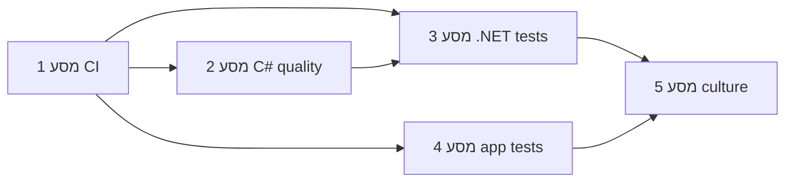

# תכנית פיתוח — אמינות קוד ובדיקות

מסמך זה מתרגם את אסטרטגיית השיפור לתכנית פיתוח מבצעית: יעדים, היקף, שלבים, משימות וקריטריוני הצלחה.

---

## 1. הקשר ויעדים

| יעד | מדד |
|-----|-----|
| הפחתת באגים בשטח | פחות תקלות חוזרות באותן נקודות קוד |
| זיהוי רגרסיות מוקדם | כל שינוי עובר build ובדיקות אוטומטיות לפני merge |
| ביטחון בשינויים | כיסוי בדיקות ללוגיקה קריטית (כיול, חישובים, זרימות ראשיות) |

**היקף:** פתרון .NET (`UnifiedSystemV1.sln` וספריות נלוות), אפליקציית `app/` (Next.js), תשתית CI ותהליכי צוות.

**מחוץ להיקף (בשלב ראשון):** רה-ארכיטקטורה מלאה, החלפת מסגרות בכל הפרויקט בבת אחת.

---

## 2. ארגון העבודה

- **אפיקים:** כל שלב (מסע 1–5) הוא אפיק שאפשר לנהל בכלי פרויקטים (Azure Boards, Jira, GitHub Projects).
- **משימות:** כל שורה בטבלאות למטה = משימה עם Definition of Done (DoD) מפורש.
- **סדר:** לבצע לפי סדר העדיפויות בסעיף 6; לא לפתוח שלב חדש בלי קריטריון יציאה מהשלב הקודם (אלא אם סוכם אחרת).

---

## 3. מסע 1 — תשתית CI ושער איכות (שבוע 1–2)

**מטרה:** כל PR מפיק build ירוק וסט בדיקות/בדיקות סטטיות מוסכמות.

| ID | משימה | DoD |
|----|--------|-----|
| M1.1 | הגדרת pipeline CI (GitHub Actions / Azure Pipelines / אחר) | Job מריץ `msbuild`/Visual Studio build ל־`UnifiedSystemV1.sln` (או סקריפט build מתועד) |
| M1.2 | הרצת `dotnet test` על פרויקטי הבדיקות בפתרון | Job נכשל אם בדיקה נכשלת; לוגים נשמרים |
| M1.3 | הרחבת `pnpm ci` ב־`app/`: הוספת `typecheck` | `package.json` מעודכן; אותו pipeline מריץ `pnpm install` + `pnpm ci` + `pnpm typecheck` |
| M1.4 | הגדרת שער merge | Branch protection: לא merge ל־main/develop בלי CI ירוק (מוגדר בצוות) |

**קריטריון יציאה ממסע 1:** pipeline ירוק על branch ראשי; משימות M1.1–M1.4 סגורות.

---

## 4. מסע 2 — איכות קוד ב־C# (שבוע 3–6, בהדרגה)

**מטרה:** הפחתת שגיאות טיפוסיות ו-null; אזהרות כבילד.

| ID | משימה | DoD |
|----|--------|-----|
| M2.1 | הוספת `Microsoft.CodeAnalysis.NetAnalyzers` לפרויקטי ליבה (רשימה מוסכמת) | Build עם אזהרות מתועדות; תיקון או suppression ממוקד עם נימוק |
| M2.2 | הפעלת nullable בהדרגה | לפחות פרויקט אחד חדש או מודול אחד מסומן `<Nullable>enable</Nullable>` / קבצים חדשים עם nullable |
| M2.3 | מיפוי מודולים קריטיים (כיול, חישובים, פרוטוקול) | מסמך קצר: רשימת DLL/תיקיות + בעלים |
| M2.4 | חילוץ לוגיקה לשכבה בדיקה (refactor ממוקד) | לפחות מודול אחד: לוגיקה עסקית נפרדת מ־UI/תשתית היכן שניתן |

**קריטריון יציאה:** analyzers פעילים בליבה; מודול קריטי אחד ממופה ועבר refactor ממוקד או תוכנית ברורה לשאר.

---

## 5. מסע 3 — בדיקות יחידה וכיסוי .NET (מתמשך)

**מטרה:** בדיקות אמיתיות ללוגיקה, לא רק “הפרויקט נטען”.

| ID | משימה | DoD |
|----|--------|-----|
| M3.1 | החלטת צוות: מסגרת אחת לפרויקטים חדשים (MSTest / xUnit / NUnit) | מסמך החלטה + פרויקט דוגמה אחד |
| M3.2 | כתיבת בדיקות יחידה למודול הכי קריטי (חישובים / ולידציה) | מינימום 5–10 בדיקות משמעותיות עם שמות שמתארים התנהגות |
| M3.3 | אינטגרציה של coverlet ב־CI עם סף התחלתי | דוח כיסוי בארטיפקטים; fail אם כיסוי יורד מתחת לסף (ניתן להתחיל ב־0% ולהעלות) |
| M3.4 | הרחבת כיסוי למודולים נוספים לפי רשימת M2.3 | תוכנית רבעונית / ספרינטים |

**קריטריון יציאה ממסע 3 (שלב ראשון):** מודול קריטי אחד עם בדיקות + דוח כיסוי ב־CI.

---

## 6. מסע 4 — אפליקציית `app/` (Next.js)

**מטרה:** בדיקות לוגיקה + E2E לזרימות ראשיות.

| ID | משימה | DoD |
|----|--------|-----|
| M4.1 | הוספת Vitest (או Jest) + דוגמה ל־utils/router קריטי | `pnpm test` עובר ב־CI; לפחות 3 בדיקות |
| M4.2 | הרצת Playwright ב־CI לזרימה קריטית אחת (למשל login או שמירה) | Job עם retry; משתני סביבה מתועדים |
| M4.3 | החלטה על Chromatic/Storybook לרגרסיית UI | go/no-go מתועד; אם כן — job אחד |

**קריטריון יציאה:** unit ללוגיקה + e2e אחד יציב ב־CI, או החלטה מתועדת לדחות e2e עם סיבה ותאריך לביקורת.

---

## 7. מסע 5 — תרבות ותחזוקה

| ID | משימה | DoD |
|----|--------|-----|
| M5.1 | כלל: תיקון באג = בדיקת רגרסיה | מופיע ב־CONTRIBUTING / README צוותי או בוויקי |
| M5.2 | מעבר על הודעות שגיאה במסלולים קריטיים | רשימת שיפורים או תיקונים שמורים |

---

## 8. סדר עדיפויות (גבולות תלות)

1. מסע 1 — חוסם הכל; בלי CI אין “תכנית” מדידה.  
2. מסע 3.2 + M3.3 — אחרי ש־`dotnet test` רץ ב־CI (M1.2).  
3. מסע 2 — במקביל למסע 3 אחרי M2.3 (מיפוי).  
4. מסע 4 — אחרי ש־`typecheck` ב־CI (M1.3).  
5. מסע 5 — מתמשך מהמסע הראשון.

---

## 9. סיכונים והקלות

| סיכון | הקלה |
|--------|------|
| זמן build ארוך | הפרדת job ל־app מול .NET במקביל; cache ל־NuGet/pnpm |
| Playwright לא יציב ב־CI | retry, סביבת staging, או הרצה לילית בהתחלה |
| עומס nullable/analyzers | אזורים חדשים קודם; תיקון הדרגתי בישן |

---

## 10. גרסה ועדכון

| גרסה | תאריך | שינוי |
|--------|--------|--------|
| 1.0 | 2026-04-20 | יצירה ראשונית מתכנית אסטרטגית |

**בעלים מומלץ:** Tech lead / מוביל איכות — עדכון רבעוני או אחרי כל מסע.
